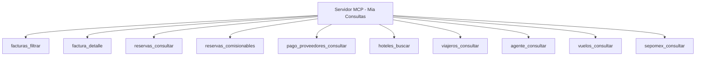

# 📋 MIA Backend API Contract — Servidor MCP de Consultas

> **Propósito del Documento:**
> Este contrato de API documenta de forma exhaustiva y estructurada todos los endpoints de **lectura y consulta** (`GET` y `POST` de búsqueda/filtrado) disponibles en el backend. Está optimizado para la definición de herramientas (*Tools*) y recursos (*Resources*) en un **servidor MCP (Model Context Protocol)** de solo lectura.

---

## 📑 Tabla de Contenido
1. [Guía de Integración y Autenticación para el MCP](#1-guía-de-integración-y-autenticación-para-el-mcp)
2. [Convenciones de Respuesta y Paginación](#2-convenciones-de-respuesta-y-paginación)
3. [Módulos V2 (Arquitectura Modular Moderna)](#3-módulos-v2-arquitectura-modular-moderna)
   - 3.1. [Facturas (`/v2/mia/factura`)](#31-módulo-facturas-v2miafactura)
   - 3.2. [Reservas (`/v2/mia/reservas`)](#32-módulo-reservas-v2miareservas)
   - 3.3. [Pago a Proveedores (`/v2/mia/pago_proveedor`)](#33-módulo-pago-a-proveedores-v2miapago_proveedor)
   - 3.4. [Dispersión (`/v2/mia/dispersion`)](#34-módulo-dispersión-v2miadispersion)
   - 3.5. [Notificaciones (`/v2/mia/notificaciones`)](#35-módulo-notificaciones-v2mianotificaciones)
4. [Módulos V1 (Catálogos y Consultas Clave de Mia)](#4-módulos-v1-catálogos-y-consultas-clave-de-mia)
   - 4.1. [Hoteles y Hospedajes (`/v1/mia/hoteles`)](#41-hoteles-y-hospedajes-v1miahoteles)
   - 4.2. [Viajeros (`/v1/mia/viajeros`)](#42-viajeros-v1miaviajeros)
   - 4.3. [Agentes y Clientes (`/v1/mia/agentes`)](#43-agentes-y-clientes-v1miaagentes)
   - 4.4. [Empresas y Datos Fiscales (`/v1/mia/empresas`, `/v1/mia/datosFiscales`)](#44-empresas-y-datos-fiscales-v1miaempresas-v1miadatosfiscales)
   - 4.5. [Reservas y Bookings V1 (`/v1/mia/reservas`, `/v1/mia/reservasClient`)](#45-reservas-y-bookings-v1-v1miareservas-v1miareservasclient)
   - 4.6. [Vuelos, Aeropuertos y Volaris (`/v1/mia/vuelos`, `/v1/mia/aeropuerto`, `/v1/mia/volaris`)](#46-vuelos-aeropuertos-y-volaris-v1miavuelos-v1miaaeropuerto-v1miavolaris)
   - 4.7. [Saldos, Crédito e Impuestos (`/v1/mia/saldo`, `/v1/mia/credito`, `/v1/mia/impuestos`)](#47-saldos-crédito-e-impuestos-v1miasaldo-v1miacredito-v1miaimpuestos)
   - 4.8. [Facturama, SEPOMEX y Utilidades (`/v1/factura`, `/v1/sepoMex`, `/v1/stripe`)](#48-facturama-sepomex-y-utilidades-v1factura-v1sepomex-v1stripe)
5. [Módulo Admin de Consulta (`/v1/admin`)](#5-módulo-admin-de-consulta-v1admin)
6. [Catálogo Sugerido de Herramientas (MCP Tools)](#6-catálogo-sugerido-de-herramientas-mcp-tools)

---

## 1. Guía de Integración y Autenticación para el MCP

El servidor MCP interactúa con el backend realizando peticiones HTTP. Todas las llamadas deben incorporar los siguientes headers estándar:

### Headers Requeridos
| Header | Tipo | Descripción | Obligatorio |
| :--- | :--- | :--- | :---: |
| `x-api-key` | `string` | Clave de API definida en `process.env.APIKEY` (`checkApiKey`). Valida el acceso en todas las rutas `/v1` y `/v2`. | **Sí** |
| `Content-Type` | `string` | `application/json` (para peticiones `POST` de filtrado). | Condicional |
| `Cookie` | `string` | `access-token=<JWT_SESSION>` para endpoints protegidos por sesión de usuario admin/agente. | Condicional |
| `Authorization` | `string` | `Bearer <JWT_TOKEN>` para tokens de un solo uso o firmas temporales. | Condicional |

> [!NOTE]
> **Autenticación por API Key:** Para un servidor MCP interno, configurar la variable de entorno `APIKEY` y enviar el header `x-api-key: <TU_API_KEY>` en cada petición resolverá el middleware de autorización raíz en `/v1` y `/v2`.

---

## 2. Convenciones de Respuesta y Paginación

### Formato Estándar de Éxito (V2 y endpoints modernos)
```json
{
  "message": "Mensaje descriptivo del resultado",
  "data": [ ... ], // Array de registros o un objeto de detalle
  "metadata": {
    "total": 125 // Número total de registros coincidentes (null si no se solicitó paginación)
  }
}
```

### Parámetros de Paginación Comunes
- `page` (*number*, default `1`): Número de página (1-based).
- `length` (*number*, default `20` o `50`): Cantidad de registros por página.

### Manejo de Errores Estándar
```json
{
  "message": "Descripción del error",
  "data": null,
  "error": {
    "code": "VALIDATION_ERROR | NOT_FOUND | DATABASE_ERROR",
    "message": "Detalle técnico del error",
    "details": {}
  }
}
```

---

## 3. Módulos V2 (Arquitectura Modular Moderna)

Prefijo base: `/v2/mia`

### 3.1. Módulo Facturas (`/v2/mia/factura`)

#### 🔹 `POST /v2/mia/factura/filtrar`
- **Descripción:** Búsqueda y listado paginado de facturas emitidas a clientes, ordenadas descendentemente por fecha e ID.
- **Body JSON (Filtros Opcionales):**
  - `estatusFactura` (*string*): Estado en `f.estado` (ej. `"Pagada"`, `"Cancelada"` o `"TODAS"`).
  - `id_factura` (*string*): Búsqueda parcial (`LIKE`) por ID de factura.
  - `id_cliente` (*string | number*): Búsqueda exacta por ID de usuario creador.
  - `cliente` (*string*): Búsqueda parcial (`LIKE`) por razón social / nombre del cliente.
  - `uuid` (*string*): Búsqueda parcial por UUID del CFDI.
  - `rfc` (*string*): Búsqueda parcial por RFC del receptor.
  - `startDate` (*string YYYY-MM-DD*): Fecha inicio creación (`>= 00:00:00`).
  - `endDate` (*string YYYY-MM-DD*): Fecha fin creación (`<= 23:59:59`).
  - `page` (*number*, default `1`): Página actual.
  - `length` (*number*, default `20`): Registros por página.
- **Estructura de Respuesta:**
  ```json
  {
    "message": "Facturas filtradas correctamente",
    "data": [
      {
        "id_factura": "FAC-001",
        "uuid_factura": "4A5B6C7D-...",
        "rfc": "XAXX010101000",
        "nombre_cliente": "Empresa Ejemplo SA de CV",
        "usuario_creador": "12",
        "total": 15000.00,
        "saldo": 0.00,
        "saldo_x_aplicar_items": 0.00,
        "estado": "Pagada",
        "created_at": "2026-08-15T12:00:00.000Z"
      }
    ],
    "metadata": { "total": 45 }
  }
  ```

#### 🔹 `GET /v2/mia/factura/detalle`
- **Descripción:** Consulta el desglose integral de una factura: reservas asignadas, saldos a favor aplicados y pagos vinculados.
- **Query Params:**
  - `id_factura` (*string*, **requerido**): Identificador de la factura.
- **Estructura de Respuesta:**
  ```json
  {
    "message": "Detalle de factura obtenido correctamente",
    "data": {
      "reservas": [
        {
          "monto_asignado": 10000.00,
          "id_relacion": "REL-100",
          "id_booking": 501,
          "id_agente": 20,
          "nombre_agente": "Agencia Viajes",
          "codigo_confirmacion": "CONF-998",
          "proveedor": "Bedsonline",
          "total": 12000.00,
          "nombre_viajero": "Carlos Ruiz"
        }
      ],
      "saldos": [
        { "monto_asignado": 2000.00, "id_saldos": "SAL-01" }
      ],
      "pagos": [
        { "monto_asignado": 8000.00, "id_pago": "PAG-01" }
      ]
    }
  }
  ```

#### 🔹 `GET /v2/mia/factura/reservas/pendientes`
- **Descripción:** Lista las reservas de un agente que aún tienen saldo pendiente por facturar (`vw.total - facturado > 0` y no canceladas).
- **Query Params:**
  - `id_agente` (*string | number*, **requerido**): ID del cliente/agente.
  - `page` (*number*, opcional): Número de página.
  - `length` (*number*, opcional, default `20`): Registros por página.
- **Estructura de Respuesta:**
  ```json
  {
    "message": "Reservas pendientes de facturar obtenidas correctamente",
    "data": [
      {
        "id_relacion": "REL-200",
        "codigo_confirmacion": "CONF-334",
        "proveedor": "Hotelbeds",
        "type": "hotel",
        "nombre_agente": "Agencia Sol",
        "metodo_pago": "credito",
        "total": 5000.00,
        "check_in": "2026-09-10",
        "check_out": "2026-09-15",
        "total_facturado": 2000.00,
        "pendiente_facturar": 3000.00
      }
    ],
    "metadata": { "total": 8 }
  }
  ```

#### 🔹 `GET /v2/mia/factura/items/pendientes`
- **Descripción:** Consulta los items individuales (noches/servicios) de una o varias reservas con sus montos facturados y por facturar.
- **Query Params:**
  - `id_relacion` (*string | string[]*, **requerido**): Uno o múltiples IDs de relación/reserva.
- **Estructura de Respuesta:**
  ```json
  {
    "message": "Items pendientes de facturar obtenidos correctamente",
    "data": [
      {
        "id_item": "ITEM-101",
        "id_relacion": "REL-200",
        "total": 1500.00,
        "monto_facturado": 500.00,
        "monto_por_facturar": 1000.00
      }
    ]
  }
  ```

---

### 3.2. Módulo Reservas (`/v2/mia/reservas`)

#### 🔹 `GET /v2/mia/reservas/solicitudes/pendientes`
- **Descripción:** Consulta solicitudes de reserva pendientes de procesar (sin booking emitido, con servicio asignado, con pago o crédito aprobado, no canceladas).
- **Query Params:** Ninguno.
- **Estructura de Respuesta:**
  ```json
  {
    "message": "Reservas obtenidas correctamente",
    "data": [
      {
        "id_solicitud": 1234,
        "id_servicio": 5678,
        "id_agente": 90,
        "status_solicitud": "Pendiente",
        "etapa_reservacion": "Reservado",
        "check_in": "2026-09-01",
        "check_out": "2026-09-05",
        "hotel_solicitud": "Grand Fiesta Americana",
        "tipo_cuarto": "Sencilla",
        "total": 4500.00,
        "nombre_cliente": "Agencia ABC",
        "nombre_viajero_solicitud": "Juan Perez",
        "metodo_pago_dinamico": "Contado"
      }
    ]
  }
  ```

#### 🔹 `GET /v2/mia/reservas/comisionables`
- **Descripción:** Consulta el catálogo de reservas comisionables (`is_comisionable = 1`) cruzando datos de bookings, solicitudes de pago a proveedores y facturas.
- **Query Params (Filtros Opcionales):**
  - `page` (*number*, default `1`): Página.
  - `length` (*number*, default `20`): Tamaño de página.
  - `proveedor` (*string*): Búsqueda parcial (`LIKE`) por nombre de proveedor.
  - `id_intermediario` (*number | string*): Búsqueda exacta por ID de intermediario.
  - `comision_cobrada` (*0 | 1*): `0` = pendiente de cobro, `1` = cobrada.
  - `comentarios_comisionables` (*string*): Búsqueda parcial en observaciones.
  - `estado` (*string*): Estatus de la reserva.
  - `codigo_confirmacion` (*string*): Búsqueda parcial por código de confirmación.
  - `checkin_inicio` / `checkin_fin` (*YYYY-MM-DD*): Rango de fechas de check-in.
  - `checkout_inicio` / `checkout_fin` (*YYYY-MM-DD*): Rango de fechas de check-out.
  - `uuid` o `uuid_factura` (*string*): UUID del CFDI de proveedor.
  - `rfc` o `rfc_factura` (*string*): RFC del emisor de factura de proveedor.
- **Estructura de Respuesta:**
  ```json
  {
    "message": "Comisionables obtenidos correctamente",
    "data": [
      {
        "id_booking": 1234,
        "id_relacion": "REL-500",
        "id_agente": 50,
        "nombre_agente": "Viajes México",
        "codigo_confirmacion": "CONF-882",
        "proveedor": "Bedsonline",
        "check_in": "2026-09-10",
        "check_out": "2026-09-15",
        "total": 8500.00,
        "costo_total": 7500.00,
        "is_comisionable": 1,
        "monto_comisionable": 1000.00,
        "porcentaje_comisionable": 11.76,
        "comision_cobrada": 0,
        "id_factura": 88,
        "uuid_factura": "UUID-...",
        "rfc_factura": "BED010101XYZ"
      }
    ],
    "metadata": { "total": 35 }
  }
  ```

---

### 3.3. Módulo Pago a Proveedores (`/v2/mia/pago_proveedor`)

#### 🔹 `GET /v2/mia/pago_proveedor/reservas`
- **Descripción:** Motor de consulta y filtrado multicriterio de solicitudes de pago a proveedores con cruce a bookings, facturas y pagos de dispersión.
- **Query Params:**
  - **Filtros de Solicitud:**
    - `estado_solicitud` (*string*): Estatus (ej. `"TRANSFERENCIA_SOLICITADA"`, `"PAGADO TRANSFERENCIA"`).
    - `estado_facturacion` (*string*): `"FACTURADO"`, `"PENDIENTE"`, etc.
    - `estatus_pagos` (*'pagado' | 'enviado_a_pago'*).
    - `forma_pago` (*'credit' | 'contado'*).
    - `bucket` (*enum*): Filtro rápido (`'spei' | 'pago_tdc' | 'pago_link' | 'pagada' | 'notificados' | 'canceladas' | 'ap_credito' | 'pendiente_credito' | 'todos'`).
    - `fecha_inicio_creacion` / `fecha_fin_creacion` (*YYYY-MM-DD*).
    - `fecha_solicitud_inicio` / `fecha_solicitud_fin` (*YYYY-MM-DD*).
    - `notas_internas` / `comentarios_ops` / `comentarios_cxp` (*string*).
  - **Filtros de Booking:**
    - `codigo_confirmacion` (*string*).
    - `cliente` (*string*): Nombre de la agencia / cliente.
    - `proveedor` (*string*): Proveedor del servicio.
    - `tipo_negociacion` (*string*).
    - `servicio` (*string*): Tipo de servicio (`'hotel' | 'vuelo' | 'renta_carros'`).
    - `checkin_inicio` / `checkin_fin` (*YYYY-MM-DD*).
  - **Includes y Facturas:**
    - `includeFacturas` (*boolean*, default `true`): Incluye cruce con facturas de proveedor.
    - `rfc` (*string*): RFC del proveedor.
    - `uuid` (*string*): UUID del CFDI.
    - `includePagos` (*boolean*, default `false`): Incluye pagos de dispersión.
    - `con_dispersion` (*boolean*): Solo solicitudes con pago dispersado.
  - **Ordenación y Paginación:**
    - `order_by` (*string*, default `'id_solicitud_proveedor'`): Campo de ordenamiento.
    - `order_dir` (*'asc' | 'desc'*, default `'desc'`).
    - `page` (*number*, default `1`): Página.
    - `length` (*number*, default `20`): Límite de registros.
- **Estructura de Respuesta:**
  ```json
  {
    "message": "Reservas de pago a proveedor obtenidas correctamente",
    "data": [
      {
        "id_solicitud_proveedor": 1001,
        "monto_solicitado": 15000.00,
        "saldo": 0.00,
        "fecha_solicitud": "2026-08-20",
        "estado_solicitud": "PAGADO TRANSFERENCIA",
        "estado_facturacion": "FACTURADO",
        "forma_pago": "contado",
        "cliente": "Agencia Sol",
        "codigo_confirmacion": "CONF-123",
        "proveedor": "Hotel Plaza",
        "check_in": "2026-09-01",
        "check_out": "2026-09-05",
        "costo_total": 12000.00,
        "total": 15000.00,
        "rfc": "HPL010101XYZ",
        "uuid": "UUID-...",
        "id_factura": 405
      }
    ],
    "metadata": { "total": 120 }
  }
  ```

#### 🔹 `POST /v2/mia/pago_proveedor/solicitudes/dispersion`
- **Descripción:** Consulta consolidada para armar la dispersión bancaria de una lista de solicitudes. Retorna cuentas bancarias asociadas (CLABE, Banco, Beneficiario) y facturas vinculadas.
- **Body JSON:**
  ```json
  {
    "ids": [1001, 1002, 1005]
  }
  ```
- **Estructura de Respuesta:**
  ```json
  {
    "message": "Solicitudes obtenidas correctamente",
    "data": [
      {
        "id_solicitud_proveedor": 1001,
        "monto_solicitado": 15000.00,
        "saldo": 15000.00,
        "saldo_dispersion": 15000.00,
        "estado_solicitud": "TRANSFERENCIA_SOLICITADA",
        "codigo_confirmacion": "CONF-123",
        "proveedor": "Hotel Plaza",
        "cuentas": [
          {
            "id_proveedor_cuenta": 12,
            "banco": "BBVA",
            "clabe": "012180001234567890",
            "cuenta": "0123456789",
            "beneficiario": "Hotel Plaza SA de CV",
            "moneda": "MXN"
          }
        ],
        "facturas": [
          {
            "id_factura": 405,
            "rfc": "HPL010101XYZ",
            "uuid": "UUID-...",
            "subtotal": 12931.03,
            "total_factura": 15000.00,
            "asignado": 15000.00
          }
        ]
      }
    ]
  }
  ```

#### 🔹 `GET /v2/mia/pago_proveedor/facturas`
- **Descripción:** Consulta el detalle completo de una factura de proveedor por su UUID de CFDI.
- **Query Params:**
  - `uuid_factura` (*string*, **requerido**): UUID del CFDI.
- **Estructura de Respuesta:**
  ```json
  {
    "message": "Factura obtenida correctamente",
    "data": {
      "id_factura_proveedor": 88,
      "uuid_cfdi": "UUID-...",
      "rfc_emisor": "PROV123456789",
      "razon_social_emisor": "Proveedor Hotelero SA",
      "subtotal": 10000.00,
      "total": 11600.00,
      "saldo": 0.00,
      "estado": "ACTIVO",
      "fecha_emision": "2026-08-20"
    }
  }
  ```

#### 🔹 `GET /v2/mia/pago_proveedor/facturas/solicitudes`
- **Descripción:** Lista todas las solicitudes de pago y reservas (bookings) asignadas a una factura por su UUID.
- **Query Params:**
  - `uuid_factura` (*string*, **requerido**): UUID del CFDI.
- **Estructura de Respuesta:**
  ```json
  {
    "message": "Solicitudes encontradas correctamente",
    "data": [
      {
        "id_solicitud": 1001,
        "id_booking": 1234,
        "codigo_confirmacion": "CONF-123",
        "monto_solicitado": 15000.00,
        "monto_facturado": 15000.00,
        "uuid_factura": "UUID-...",
        "estado": "PAGADO TRANSFERENCIA"
      }
    ]
  }
  ```

---

### 3.4. Módulo Dispersión (`/v2/mia/dispersion`)

#### 🔹 `GET /v2/mia/dispersion`
- **Descripción:** Consulta el historial de dispersiones de pagos a proveedores realizadas.
- **Query Params:**
  - `codigo_dispersion` (*string*): Búsqueda parcial por código de dispersión.
  - `fecha_pago_inicio` / `fecha_pago_fin` (*YYYY-MM-DD*): Rango de fechas de pago.
  - `id_proveedor_cuenta` (*string*): ID de cuenta bancaria.
  - `id_solicitud_proveedor` (*string*): IDs separados por comas.
  - `saldo_cero` (*boolean*, default `true`): Filtra pagos con saldo mayor a 0.
  - `page` (*number*, default `1`): Página.
  - `length` (*number*, default `20`): Registros por página.
- **Estructura de Respuesta:**
  ```json
  {
    "message": "Dispersiones obtenidas correctamente",
    "data": [
      {
        "id_dispersion_pagos_proveedor": 1,
        "id_solicitud_proveedor": 1001,
        "monto_solicitado": 15000.00,
        "monto_pagado": 15000.00,
        "codigo_dispersion": "DISP-2026-001",
        "fecha_pago": "2026-08-20",
        "url_comprobante": "https://s3.amazonaws.com/...",
        "id_proveedor_cuenta": "12"
      }
    ],
    "metadata": { "total": 15 }
  }
  ```

---

### 3.5. Módulo Notificaciones (`/v2/mia/notificaciones`)

#### 🔹 `GET /v2/mia/notificaciones/comisionables/conteo`
- **Descripción:** Retorna el conteo total de reservas comisionables pendientes de cobro (`is_comisionable = 1 AND comision_cobrada = 0`).
- **Query Params:** Ninguno.
- **Estructura de Respuesta:**
  ```json
  {
    "message": "ok",
    "data": {
      "conteo": 14
    }
  }
  ```

---

## 4. Módulos V1 (Catálogos y Consultas Clave de Mia)

Prefijo base: `/v1/mia` (o `/v1` para utilidades generales)

### 4.1. Hoteles y Hospedajes (`/v1/mia/hoteles`)

| Endpoint | Método | Parámetros Clave | Descripción |
| :--- | :---: | :--- | :--- |
| `/v1/mia/hoteles/` | `GET` | Ninguno | Consulta catálogo completo de hoteles con habitaciones agrupadas. |
| `/v1/mia/hoteles/allowed` | `GET` | `id_agente`, `zona`, `hotel`, `estado`, `priority`, `is_allowed`, `precio_min`, `precio_max`, `page`, `length` | Consulta de hoteles prioritarios/permitidos por cliente con paginación (`vw_client_hotel_priority_full`). |
| `/v1/mia/hoteles/hotelesWithTarifa` | `GET` | Ninguno | Listado de hoteles con tarifas configuradas. |
| `/v1/mia/hoteles/tarifas_by_id` | `GET` | `id` (*requerido*) | Consulta la tarifa activa de un hotel desde `vw_hoteles_tarifas_completa`. |
| `/v1/mia/hoteles/Consultar-hoteles` | `GET` | Ninguno | Ejecuta SP `sp_nuevo_get_hoteles` (catálogo maestro). |
| `/v1/mia/hoteles/Consultar-precio-sencilla/:id_hotel` | `GET` | `:id_hotel` (*path*) | Retorna tarifa de habitación sencilla (`get_precio_habitacion_sencilla`). |
| `/v1/mia/hoteles/Consultar-precio-doble/:id_hotel` | `GET` | `:id_hotel` (*path*) | Retorna tarifa de habitación doble (`get_precio_habitacion_doble`). |
| `/v1/mia/hoteles/Consulta-Hoteles-por-termino` | `GET` | `termino` (*requerido*) | Búsqueda rápida por nombre de hotel, ciudad o zona (`sp_Hoteles_Buscar`). |
| `/v1/mia/hoteles/Filtro-avanzado` | `POST` | Body: `{ nombre, estado, rfc, tipo_hospedaje, tipo_negociacion, sencilla_precio_min, ... }` | Búsqueda multicriterio avanzada ejecutando `filtro_completo`. |
| `/v1/mia/hoteles/cotizacion` | `GET` | `ciudad`, `hotel`, `cp`, `lat`, `lng`, `checkin`, `checkout`, `id_hotel`, `id_cliente` | Consulta y cotización de hoteles por ubicación y fechas. |
| `/v1/mia/hoteles/getReportePorEstado` | `GET` | `cadena` | Reporte analítico de reservas confirmadas agrupadas por estado federativo. |
| `/v1/mia/hoteles/getTopClientes` | `GET` | `estado`, `cadena`, `mostrarTodos` | Ranking Top 10 de clientes con mayor volumen de reservas. |
| `/v1/mia/hoteles/getTopProveedores` | `GET` | `estado`, `cadena`, `mostrarTodos` | Ranking Top 10 de hoteles/proveedores con mayor monto reservado. |
| `POST /search-hotel` | `POST` | Body: `{ hoteles: string[], checkin, checkout }` | Scraper / Asistente IA para consulta de tarifas de hoteles en tiempo real. |

---

### 4.2. Viajeros (`/v1/mia/viajeros`)

| Endpoint | Método | Parámetros Clave | Descripción |
| :--- | :---: | :--- | :--- |
| `/v1/mia/viajeros/` | `GET` | Ninguno | Lista todos los viajeros registrados. |
| `/v1/mia/viajeros/get-all-viajeros` | `GET` | Ninguno | Viajeros con información de empresa y agente (`viajeros_con_empresas_con_agentes`). |
| `/v1/mia/viajeros/get-viajeros-by-agente/:id_agente` | `GET` | `:id_agente` (*path*) | Lista viajeros asignados al agente (`get_viajeros_by_id_agente`). |
| `/v1/mia/viajeros/id` | `GET` | `id` (*query id_agente*) | Viajeros vinculados a las empresas de un agente. |
| `/v1/mia/viajeros/by-agente` | `GET` | `id` (*query id_agente*) | Relaciones directas en `agentes_viajeros`. |

---

### 4.3. Agentes y Clientes (`/v1/mia/agentes`)

| Endpoint | Método | Parámetros Clave | Descripción |
| :--- | :---: | :--- | :--- |
| `/v1/mia/agentes/agentes` | `GET` | Ninguno | Lista general de agentes registrados. |
| `/v1/mia/agentes/get-agente-id` | `GET` | `nombre`, `correo` | Búsqueda de agente por nombre o email (`buscar_agente`). |
| `/v1/mia/agentes/empresas` | `GET` | `id` (*id_agente*) | Empresas y RFCs asociados al agente. |
| `/v1/mia/agentes/all` | `GET` | `startDate`, `endDate`, `vendedor`, `estado_credito`, `client` | Directorio de clientes con crédito y saldos desde `agente_details`. |
| `/v1/mia/agentes/all-with-active-facturable-saldos` | `GET` | Mismos filtros que `/all` | Directorio de agentes con arreglo de saldos a favor facturables embebido. |
| `/v1/mia/agentes/id` | `GET` | `id` (*id_agente*) | Perfil completo del agente (wallet, saldo, crédito disponible). |
| `/v1/mia/agentes/ficha/resumen` | `GET` | `id_agente` | Resumen analítico: negociaciones, estados de reserva y gasto mensual. |

---

### 4.4. Empresas y Datos Fiscales (`/v1/mia/empresas`, `/v1/mia/datosFiscales`)

| Endpoint | Método | Parámetros Clave | Descripción |
| :--- | :---: | :--- | :--- |
| `/v1/mia/empresas/` | `GET` | Ninguno | Catálogo maestro de empresas. |
| `/v1/mia/empresas/getAll` | `GET` | Ninguno | Vista detallada de empresas y datos fiscales (`vw_datos_fiscales_detalle`). |
| `/v1/mia/empresas/id` | `GET` | `id` (*id_empresa*) | Consulta de empresa por ID. |
| `/v1/mia/empresas/agente` | `GET` | `id` (*id_agente*) | Empresas asociadas a un agente con su información fiscal. |
| `/v1/mia/datosFiscales/` | `GET` | Ninguno | Catálogo general de registros fiscales. |
| `/v1/mia/datosFiscales/id` | `GET` | `id` (*id_datos_fiscales*) | Consulta de detalle fiscal específico (RFC, razón social, régimen, CP). |

---

### 4.5. Reservas y Bookings V1 (`/v1/mia/reservas`, `/v1/mia/reservasClient`)

| Endpoint | Método | Parámetros Clave | Descripción |
| :--- | :---: | :--- | :--- |
| `/v1/mia/reservas/v2/cupon` | `GET` | `id` (*id_booking*) | Datos estructurados para generación de cupón (hotel/vuelo/auto). |
| `/v1/mia/reservas/id` | `GET` | `id` (*id_booking*) | Consulta completa de una reserva con hospedaje, items y pagos. |
| `/v1/mia/reservas/allFacturacion` | `GET` | `id_booking`, `id_relacion`, `estado_reserva`, `hotel`, `client`, `traveler`, `startDate`, `endDate`, `pag`, `limite` | Listado general de facturación con paginación (`sp_get_reserva_all_facturacion2`). |
| `/v1/mia/reservas/services` | `GET` | `codigo_reservacion`, `proveedor`, `id_client`, `client`, `traveler`, `status`, `paymentMethod`, `page`, `length` | Consulta unificada de servicios y reservas con filtros dinámicos. |
| `/v1/mia/reservas/reservasConItems` | `GET` | `id_agente` | Reservas del agente con items pendientes de facturar. |
| `/v1/mia/reservas/reservasConItemsSinPagar` | `GET` | `id_agente` | Reservas del agente pendientes de pago. |
| `/v1/mia/reservas/detalles_reservas` | `GET`/`POST` | `id_hospedaje` o `id_buscar` | Pagos, saldos a favor, facturas y resumen de hospedajes (`sp_hospedaje_detalles`). |
| `/v1/mia/reservas/verificar-empalme` | `GET` | `viajero`, `fecha` | Valida si un viajero tiene otra reserva de hotel activa en esa fecha. |
| `/v1/mia/reservas/verificar-traslape` | `GET` | `id_viajero`, `check_in`, `check_out` | Valida traslape de rangos de fechas para un viajero. |
| `/v1/mia/reservas/cotizaciones` | `GET` | `servicio` | Cotizaciones por servicio desde `vw_solicitud_cotizaciones`. |
| `/v1/mia/reservas/cupon/vuelo` | `GET` | `id_viaje_aereo` | Cupón de vuelos con itinerario completo y aerolíneas. |
| `/v1/mia/reservas/cupon/auto` | `GET` | `id_renta_autos` | Cupón de renta de auto con conductor y sucursales de entrega. |
| `POST /v1/mia/reservasClient/filtro_solicitudes_y_reservas` | `POST` | Body: `{ codigo_reservacion, client, status, traveler, startDate, endDate, ... }` | Filtro de reservas y solicitudes para panel de cliente/admin (`sp_filtrar_solicitudes_y_reservas2`). |
| `POST /v1/mia/reservasClient/todas_las_reservas` | `POST` | Body: `{ user_id, tipo: 'hotel'|'vuelo'|'renta_carros' }` | Reservas confirmadas filtradas por tipo de servicio. |

---

### 4.6. Vuelos, Aeropuertos y Volaris (`/v1/mia/vuelos`, `/v1/mia/aeropuerto`, `/v1/mia/volaris`)

| Endpoint | Método | Parámetros Clave | Descripción |
| :--- | :---: | :--- | :--- |
| `/v1/mia/vuelos/` | `GET` | Ninguno | Lista general de viajes aéreos registrados. |
| `/v1/mia/vuelos/id` | `GET` | `id` (*id_booking*) | Desglose completo de viaje aéreo (tramos, aeropuertos origen/destino, costos, viajero). |
| `/v1/mia/vuelos/cupon` | `GET` | `viajero`, `codigo_confirmacion`, `created_inicio`, `created_fin`, `page` | Consulta paginada de cupones de viajes aéreos (`vw_viaje_aereo`). |
| `/v1/mia/aeropuerto/` | `GET` | Ninguno | Catálogo oficial de aeropuertos y claves IATA. |
| `POST /v1/mia/volaris/booking` | `POST` | Body: `{ recordLocator, lastName }` | Consulta y extracción en tiempo real del estatus de una reserva en Volaris. |

---

### 4.7. Saldos, Crédito e Impuestos (`/v1/mia/saldo`, `/v1/mia/credito`, `/v1/mia/impuestos`)

| Endpoint | Método | Parámetros Clave | Descripción |
| :--- | :---: | :--- | :--- |
| `/v1/mia/saldo/` | `GET` | Ninguno | Lista general de saldos a favor. |
| `/v1/mia/saldo/types` | `GET` | `id_agente` | Saldos a favor activos agrupados por método de pago. |
| `/v1/mia/saldo/type` | `GET` | `type`, `id_agente`, `id_hospedaje` | Saldos activos para asignación de saldos en admin. |
| `/v1/mia/credito/` | `GET` | `id_agente` | Consulta de saldo de crédito y condición de crédito consolidado. |
| `/v1/mia/impuestos/` | `GET` | Ninguno | Catálogo de impuestos configurados (`IVA 16%`, `ISH 3%`, etc.). |

---

### 4.8. Facturama, SEPOMEX y Utilidades (`/v1/factura`, `/v1/sepoMex`, `/v1/stripe`)

| Endpoint | Método | Parámetros Clave | Descripción |
| :--- | :---: | :--- | :--- |
| `/v1/factura/clients` | `GET` | Ninguno | Lista todos los clientes registrados en el PAC Facturama. |
| `/v1/factura/clients/rfc` | `GET` | `rfc` (*requerido*) | Obtiene cliente en Facturama por su RFC. |
| `/v1/factura/invoices` | `GET` | `rfc` (*requerido*) | Facturas emitidas asociadas a un RFC. |
| `/v1/factura/invoices-by-date` | `GET` | `start`, `end` (*YYYY-MM-DD*) | Lista facturas emitidas en un rango de fechas. |
| `/v1/factura/cfdi` | `GET` | `id`, `type` (`issued`) | Consulta CFDI timbrado completo directamente en Facturama. |
| `/v1/sepoMex/buscar-codigo-postal` | `GET` | `d_codigo` (*CP 5 dígitos*) | Consulta colonias, municipios y estados de un código postal en México. |
| `/v1/stripe/get-payment-methods` | `GET` | `id_agente` | Consulta tarjetas / métodos de pago guardados en Stripe para el agente. |
| `/v1/getPeriodosReservas` | `GET` | Ninguno | Periodos registrados en snapshots históricos de reservas. |

---

## 5. Módulo Admin de Consulta (`/v1/admin`)

Requiere `x-api-key` y sesión de administrador (cookie `access-token`).

| Endpoint | Método | Parámetros Clave | Descripción |
| :--- | :---: | :--- | :--- |
| `/v1/admin/auth/verify-session` | `GET` | Cookie `access-token` | Comprueba la sesión activa del usuario y retorna sus datos y permisos. |
| `/v1/admin/auth/usuarios` | `GET` | Ninguno | Lista todos los usuarios administradores, roles y estado activo. |
| `/v1/admin/auth/permisos` | `GET` | `id` (*userId*) | Lista todos los permisos del sistema indicando si el usuario los tiene activos. |
| `/v1/admin/auth/role` | `GET` | `id` (*roleId*) | Obtiene todos los permisos asociados a un rol. |
| `/v1/admin/user/roles` | `GET` | Ninguno | Catálogo de roles disponibles en la plataforma admin. |

---

## 6. Catálogo Sugerido de Herramientas (MCP Tools)

Para implementar el **Servidor MCP de Consultas**, se recomienda definir las siguientes herramientas (*Tools*):



### Tabla de Tools Recomendadas
| Nombre MCP Tool | Endpoint Backend | Descripción para el Modelo AI |
| :--- | :--- | :--- |
| `facturas_filtrar` | `POST /v2/mia/factura/filtrar` | Filtra facturas por RFC, cliente, UUID, estado o rango de fechas con paginación. |
| `factura_detalle` | `GET /v2/mia/factura/detalle` | Obtiene el detalle financiero de una factura (reservas, saldos aplicados y pagos). |
| `facturas_pendientes_agente` | `GET /v2/mia/factura/reservas/pendientes` | Lista reservas pendientes de facturación para un agente específico. |
| `reservas_consultar` | `GET /v1/mia/reservas/services` | Busca reservas y servicios (hotel, vuelo, auto) por código de confirmación, cliente o viajero. |
| `reservas_comisionables` | `GET /v2/mia/reservas/comisionables` | Consulta reservas con comisión pendiente o cobrada, cruzadas con facturas y proveedores. |
| `pago_proveedores_consultar` | `GET /v2/mia/pago_proveedor/reservas` | Consulta solicitudes de pago a proveedores con filtros de estado, cuentas y fechas. |
| `hoteles_buscar` | `GET /v1/mia/hoteles/allowed` | Busca hoteles en catálogo con tarifas, zonas, prioridades y filtros de cliente. |
| `hoteles_cotizar` | `GET /v1/mia/hoteles/cotizacion` | Cotiza tarifas de hotel por ciudad, fechas de check-in / check-out y número de huéspedes. |
| `viajeros_consultar` | `GET /v1/mia/viajeros/id` | Consulta viajeros asociados a un agente o empresa. |
| `agente_consultar_perfil` | `GET /v1/mia/agentes/id` | Obtiene el perfil financiero del agente (saldo en wallet, límite y estado de crédito). |
| `vuelo_detalle` | `GET /v1/mia/vuelos/id` | Consulta el itinerario detallado de un viaje aéreo (tramos, aerolíneas, horarios). |
| `sepomex_codigo_postal` | `GET /v1/sepoMex/buscar-codigo-postal` | Consulta colonias, municipios y estados de un código postal mexicano. |
