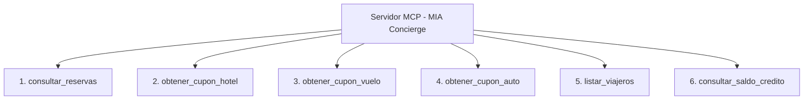

# 🚀 Propuesta Técnica y Ejecutiva: Servidor MCP de Consultas para Clientes (MIA Travel Concierge)

**Fecha:** 31 de Agosto de 2026  
**Preparado para:** Dirección de Tecnología y Liderazgo de Proyecto  
**Estado:** Propuesta de Implementación V1.0  
**Documento Complementario:** [API_CONTRACT.md](./API_CONTRACT.md)

---

## 1. Resumen Ejecutivo

Proponemos la creación de un **Servidor MCP (Model Context Protocol)** de solo lectura, diseñado específicamente para habilitar un **Asistente Inteligente de Viajes (Concierge)** para los clientes/agencias de MIA.

A diferencia de una integración genérica o de bots tradicionales, este servidor MCP permite que cualquier modelo de lenguaje (Claude, ChatGPT, Gemini, etc.) consulte la información operativa de MIA en tiempo real de forma **segura, rápida y con un costo de tokens mínimo**, respondiendo preguntas como:
- *"¿Cuáles son mis reservas activas para la próxima semana?"*
- *"Muéstrame el cupón de vuelo y las escalas de Carlos Ruiz."*
- *"¿Cuál es mi saldo a favor disponible y mi límite de crédito?"*

---

## 2. Objetivos y Beneficios Clave

| Beneficio | Impacto en el Negocio / Técnico |
| :--- | :--- |
| 🔒 **Seguridad Multi-Tenant por Diseño** | El servidor MCP inyecta un `id_agente` preconfigurado. El modelo de IA **no puede acceder** a datos de otras empresas bajo ninguna circunstancia. |
| ⚡ **Ahorro de Tokens (>75%)** | En lugar de cargar catálogos pesados en el prompt, el MCP expone herramientas compactas con filtros obligatorios (ej. reservas futuras vs. pasadas). |
| 🏎️ **Velocidad y Cero Saturación** | Solo 6 herramientas enfocadas en lugar de 40+ endpoints dispersos, evitando confusión (*tool hallucination*) y reduciendo la latencia de respuesta. |
| 🔌 **Fácil Integración (Solo API Key)** | Para esta primera fase de pruebas, la conexión se autentica únicamente mediante `x-api-key` a nivel servidor, sin requerir manejo complejo de sesiones. |

---

## 3. Catálogo de Herramientas Propuestas (V1.0)

Para la primera versión funcional, priorizamos **6 herramientas clave** que cubren el 100% de las necesidades de consulta de un cliente:



### Detalle de las Herramientas:

### 1. `consultar_reservas` *(Motor Principal)*
* **Propósito:** Búsqueda controlada de reservas de hotel, vuelos y autos del cliente.
* **Regla de Negocio / Guardrail:** Para evitar volcados masivos de datos que saturen la ventana de contexto del LLM, se exige al modelo proveer al menos:
  1. `temporalidad`: `'proximas'` (check-in $\ge$ hoy) | `'pasadas'` (check-out $<$ hoy) | `'todas'`.
  2. `id_viajero`, `tipo_servicio` o `codigo_confirmacion` (filtros discriminadores).
* **Paginación:** Máximo 10 registros por llamada.

### 2. `obtener_cupon_hotel`
* **Propósito:** Detalle completo de una estancia (hotel, fechas check-in/out, tipo de cuarto, número de confirmación, viajero titular y notas).
* **Endpoint Base:** `GET /v1/mia/reservas/v2/cupon?id={id_booking}`.

### 3. `obtener_cupon_vuelo`
* **Propósito:** Desglose del itinerario aéreo (tramos ida/vuelta, aerolíneas, aeropuertos origen/destino IATA, horarios, equipaje incluido y asientos).
* **Endpoint Base:** `GET /v1/mia/reservas/cupon/vuelo?id_viaje_aereo={id}`.

### 4. `obtener_cupon_auto`
* **Propósito:** Ficha de renta de automóvil (arrendadora, modelo, sucursales de recolección/devolución y conductor titular).
* **Endpoint Base:** `GET /v1/mia/reservas/cupon/auto?id_renta_autos={id}`.

### 5. `listar_viajeros`
* **Propósito:** Directorio de colaboradores y pasajeros registrados de la agencia (nombre, correo, ID viajero, número de empleado).
* **Endpoint Base:** `GET /v1/mia/viajeros/id?id={id_agente}`.

### 6. `consultar_saldo_credito`
* **Propósito:** Consulta instantánea de estado de cuenta: saldo disponible en wallet y estatus de línea de crédito.
* **Endpoint Base:** `GET /v1/mia/credito/?id_agente={id_agente}` y `GET /v1/mia/saldo/types`.

---

## 4. Requerimiento Técnico Recomendado en Backend (V2)

Para asegurar la máxima velocidad en la consulta de reservas, recomendamos habilitar un endpoint ligero en la arquitectura moderna de V2:

* **Ruta sugerida:** `POST /v2/mia/reservas/cliente/filtrar` (o `GET /v2/mia/reservas/cliente`)
* **Ventaja:** Conecta directamente a la vista optimizada de reservas de cliente (`vw_reservas_cliente`), filtrando por `id_agente` con soporte nativo para los flags de `temporalidad` (`proximas`/`pasadas`).

---

## 5. Roadmap de Implementación

```
[ Fase 1: Actual ] ──> Relevamiento y API Contract completo (Listo en API_CONTRACT.md)
[ Fase 2: Backend ] ─> Exposición del endpoint optimizado v2 de reservas para cliente
[ Fase 3: MCP ] ─────> Implementación del servidor MCP (Node.js / TypeScript con SDK MCP)
[ Fase 4: Pruebas ] ─> Conexión con Claude Desktop / Web / Agentes IA y pruebas piloto con cliente
```

---

## 6. Conclusión y Siguiente Paso

Esta arquitectura permite poner a prueba la tecnología MCP de inmediato con un riesgo nulo, garantizando seguridad estricta para el cliente y un control absoluto sobre el consumo de tokens y el rendimiento del servidor.

**Acción solicitada:** Aprobación de las 6 herramientas propuestas para proceder a la construcción del servidor MCP.
